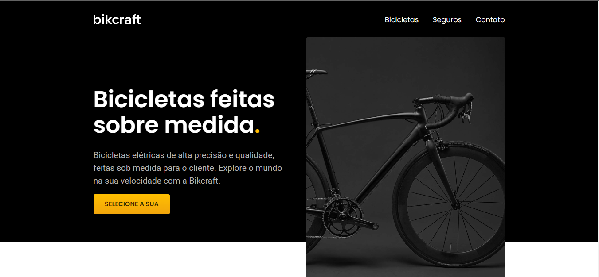

# Bikcraft

##

- Gustavo Rodrigues
- Estudante de Jogos Digitais Frond-End | Ui & Ux Design

- Projeto feito em conjunto do Curso Origamid, prof: Andre. 👨🏿‍🎓

## Tecnologias Utilizadas

 
  
  
            
  
  
  
  

